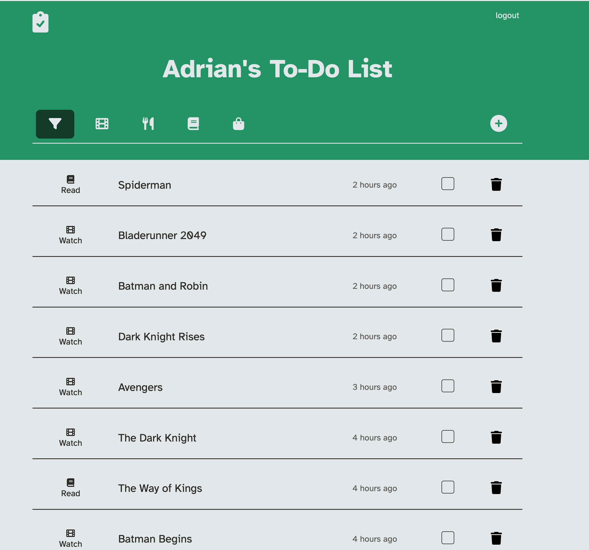
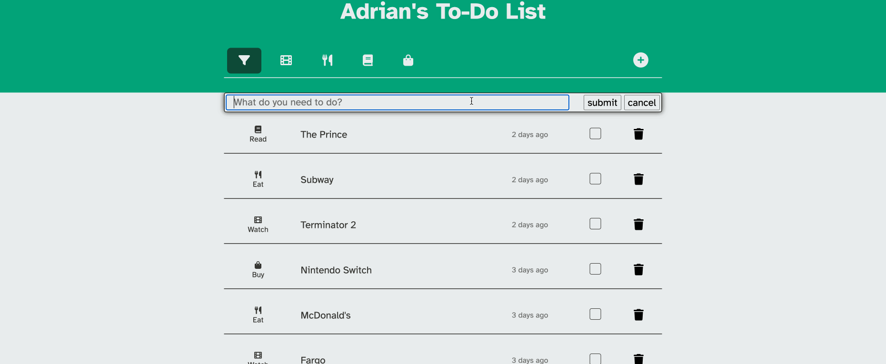
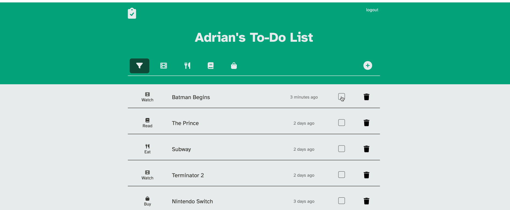
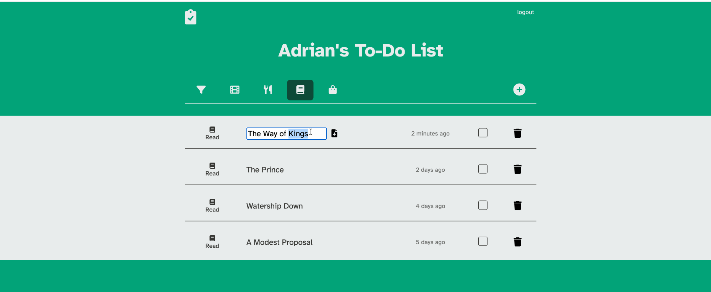

# Smart Todo List

This project is the midterm project for Lighthouse Labs' Web Development Bootcamp.

## Table of Contents

- [Overview)[#overview]
  - [Project Goals](#project-goals)
  - [Screenshots](#screenshots)
- [Process](#process)
  - [Built With](#built-with)
  - [Learning Takeaways](#learning-takeaways)
  - [Known Issues](#known-issues)
  - [Further Development](#further-development)
- [Authors](#authors)

## Overview

### Project Goals

We set out to build the "Smart Todo List" project which should be able to not only track a users tasks, but also automatically classify them into certain categories.

### Screenshots

Todo List

Classifying a new task

Marking a task as complete

Editing a task

## Process

We first collaborated on planning out our app by visiting user stories. From that, the database schema, a wireframe, and routes were planned. It was decided that we could split the work into frontend and backend and we set out to get each part functioning separately.

Some research was done into data sources that might help us to classify our tasks. After getting developer access to the APIs, we collaborated on the logic to process the data and reduce the output to a single backend route that could control the classification of new tasks upon creation.

We teamed up on a huge restyle to make the app look more modern and refine the user interface. Finally, some documentation was made up and a couple lingering bugs were squashed.

### Built With

- Backend: Postgres, Express
- Frontend: jQuery, Sass

### Learning Takeaways

- CSS subsequent-sibling combinator `~` to apply styles to an element based on the state of a different element
- Testing backend APIs using curl to ensure that routes and processing are done correctly before attempting to attach frontend.
- Parsing API documentation to find out how to actually make a request. This is generally quite difficult, and you have to get an API key to even see what the data is like. An awful experience on most platforms. Luckily, the npm package request allows the request to be formatted once using a nice javascript object.

### Known Issues

- Redirection after login not working, refresh needed

### Further Development

- Database deployed in the cloud
- Login/Registration for new users

## Team

Adrian To | [github.com/adrianetodesign](https://github.com/adrianetodesign)

Logan Woolf | [github.com/loganwoolf](https://github.com/loganwoolf) | [twitter.com/logan__woolf](https://twitter.com/logan__woolf)
